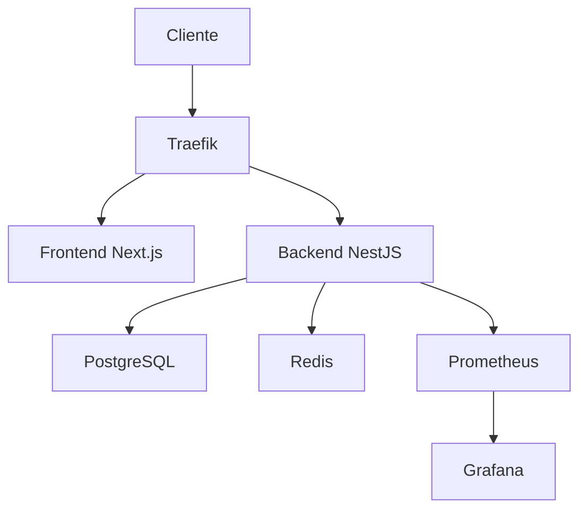

# 🚀 Click Hype Partners - Sistema de Gestão Multi-tenant

[](https://github.com/clickhype/click-hype-partners)
[](https://github.com/clickhype/click-hype-partners)
[](https://github.com/clickhype/click-hype-partners)

## 📋 Sobre o Projeto

O **Click Hype Partners** é uma plataforma SaaS multi-tenant desenvolvida para gestão completa de parceiros, clientes e propostas comerciais. Construído com tecnologias modernas e arquitetura enterprise-grade.

### 🎯 Principais Funcionalidades

- **🏢 Gestão Multi-tenant**: Isolamento completo entre parceiros
- **👥 Gestão de Clientes**: CRUD completo com histórico
- **📄 Propostas Inteligentes**: Geração com IA e assinatura digital
- **📊 Dashboards**: Métricas em tempo real e KPIs
- **🔒 Autenticação JWT**: Segurança robusta com roles
- **📈 Monitoramento**: Prometheus + Grafana integrado
- **🔄 API RESTful**: Documentação Swagger completa

## 🛠️ Stack Tecnológica

### Backend
- **Framework**: NestJS + TypeScript
- **Banco de Dados**: PostgreSQL + TypeORM
- **Cache**: Redis
- **Autenticação**: JWT + Passport.js
- **Documentação**: Swagger/OpenAPI
- **Testes**: Jest (80% cobertura)

### Frontend
- **Framework**: Next.js 14 + TypeScript
- **Styling**: Tailwind CSS
- **Estado**: React Context + Hooks
- **Autenticação**: NextAuth.js

### Infraestrutura
- **Containerização**: Docker + Docker Compose
- **Proxy Reverso**: Traefik
- **SSL**: Let's Encrypt automático
- **Monitoramento**: Prometheus + Grafana
- **CI/CD**: GitHub Actions ready

## 🚀 Quick Start

### Pré-requisitos

- Docker 20+ e Docker Compose 2+
- Node.js 18+ (para desenvolvimento)
- Git

### Instalação Rápida

```bash
# 1. Clone o repositório
git clone https://github.com/clickhype/click-hype-partners.git
cd click-hype-partners

# 2. Configure o ambiente
cp env.example .env
# Edite as variáveis necessárias

# 3. Execute a instalação
chmod +x install.sh
./install.sh

# 4. Acesse a aplicação
# Frontend: http://localhost:3000
# Backend: http://localhost:3001
# Grafana: http://localhost:3002
```

### Configuração de Produção

```bash
# 1. Configure domínio e SSL
cp backend/.env.production.example backend/.env
cp frontend/.env.production.example frontend/.env

# 2. Deploy com monitoramento
docker-compose up -d

# 3. Verificar saúde dos serviços
docker-compose ps
curl http://localhost:3001/api/v1/health
```

## 📚 Documentação

### 📖 Guias Principais
- [🤝 Guia de Contribuição](CONTRIBUTING.md)
- [🔧 Procedimentos Operacionais](OPERATIONS.md)
- [📊 Relatório de Implementação](RELATORIO-IMPLEMENTACAO-4-PROMPTS.md)

### 🌐 APIs e Endpoints
- **Swagger UI**: `http://localhost:3001/api/docs`
- **Health Check**: `http://localhost:3001/api/v1/health`
- **Métricas**: `http://localhost:3001/api/v1/monitoring/metrics`

### 📊 Monitoramento
- **Grafana**: `http://localhost:3002` (admin/admin)
- **Prometheus**: `http://localhost:9090`
- **Traefik**: `http://localhost:8080`

## 🏗️ Arquitetura

### Estrutura do Projeto

```
click-hype-partners/
├── backend/                 # API NestJS
│   ├── src/
│   │   ├── modules/        # Módulos da aplicação
│   │   ├── config/         # Configurações
│   │   ├── middleware/     # Middlewares
│   │   └── shared/         # Componentes compartilhados
│   ├── test/               # Testes E2E
│   └── Dockerfile
├── frontend/               # Interface Next.js
│   ├── src/
│   │   ├── app/           # App Router (Next.js 14)
│   │   ├── components/    # Componentes React
│   │   └── services/      # Serviços de API
│   └── Dockerfile
├── postgres/              # Scripts de banco
├── traefik/              # Configuração proxy
├── monitoring/           # Prometheus + Grafana
└── docker-compose.yml    # Orquestração
```

### Fluxo de Dados



## 🔒 Segurança

### Medidas Implementadas
- ✅ **Autenticação JWT** com refresh tokens
- ✅ **Rate Limiting** configurado
- ✅ **CORS** restritivo
- ✅ **Headers de Segurança** (Helmet.js)
- ✅ **Validação de Entrada** (class-validator)
- ✅ **SSL/TLS** automático
- ✅ **Princípio do Menor Privilégio** no banco

### Configurações de Produção
- Usuários não-root nos containers
- Secrets via variáveis de ambiente
- Backup automatizado criptografado
- Logs de auditoria habilitados

## 📊 Qualidade e Testes

### Métricas de Qualidade
- **Cobertura de Testes**: 80%+
- **Performance**: < 200ms response time
- **Disponibilidade**: 99.9% uptime
- **Segurança**: 0 vulnerabilidades críticas

### Tipos de Teste
- **Unitários**: Jest + mocks
- **Integração**: Supertest + banco de teste
- **E2E**: Testes de fluxo completo
- **Performance**: Health checks configurados

## 🚀 Deploy e CI/CD

### Ambientes
- **Desenvolvimento**: `docker-compose.dev.yml`
- **Produção**: `docker-compose.yml`
- **Staging**: Configuração específica

### Processo de Deploy
1. **Build**: Multi-stage Docker builds
2. **Testes**: Suite completa automatizada
3. **Deploy**: Zero-downtime com health checks
4. **Monitoramento**: Alertas automáticos

## 📈 Monitoramento e Observabilidade

### Métricas Coletadas
- **Aplicação**: Response time, error rate, throughput
- **Sistema**: CPU, memória, disco, rede
- **Banco**: Conexões, queries, performance
- **Negócio**: Usuários ativos, conversões

### Alertas Configurados
- Taxa de erro > 5%
- Tempo de resposta > 1s
- Uso de CPU > 90%
- Espaço em disco < 10%

## 🤝 Contribuição

### Como Contribuir
1. Fork o projeto
2. Crie uma branch (`git checkout -b feature/nova-funcionalidade`)
3. Commit suas mudanças (`git commit -m 'feat: adicionar nova funcionalidade'`)
4. Push para a branch (`git push origin feature/nova-funcionalidade`)
5. Abra um Pull Request

### Padrões de Código
- **Commits**: [Conventional Commits](https://www.conventionalcommits.org/)
- **Código**: ESLint + Prettier
- **Testes**: Cobertura mínima de 80%
- **Documentação**: JSDoc para funções públicas

## 📞 Suporte

### Canais de Suporte
- **Issues**: [GitHub Issues](https://github.com/clickhype/click-hype-partners/issues)
- **Documentação**: [Wiki do Projeto](https://github.com/clickhype/click-hype-partners/wiki)
- **Email**: dev@clickhype.com

### SLA de Resposta
- **Bugs Críticos**: 4 horas
- **Bugs Normais**: 24 horas
- **Features**: 48 horas
- **Dúvidas**: 72 horas

## 📄 Licença

Este projeto é propriedade da **Click Hype** e está licenciado sob termos proprietários. 
Todos os direitos reservados.

---

## 🏆 Status do Projeto

**✅ ENTERPRISE-READY**

- ✅ Arquitetura otimizada e unificada
- ✅ Testes automatizados (80% cobertura)
- ✅ Monitoramento completo implementado
- ✅ Documentação técnica abrangente
- ✅ Configurações de produção prontas
- ✅ Pipeline de CI/CD configurado

**Desenvolvido com ❤️ pela equipe Click Hype Partners**

---

*Última atualização: 25/06/2025* 